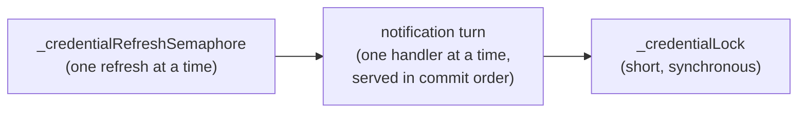
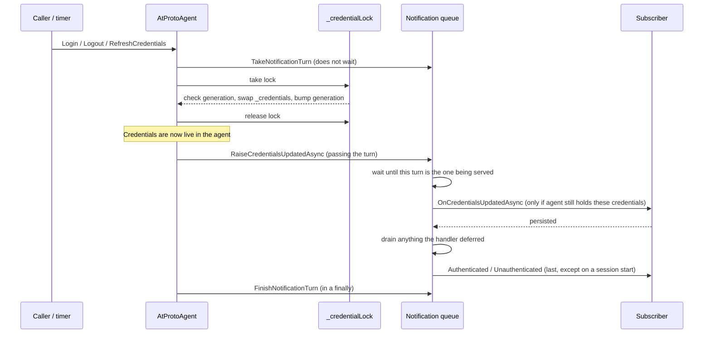
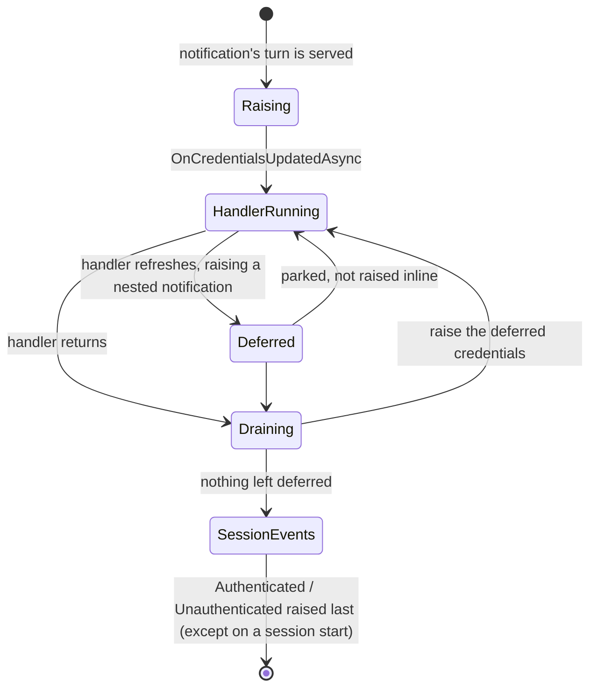

# Credential lifecycle, locking and ordering

This note describes how `AtProtoAgent` holds credentials, how it tells subscribers about them, and the rules which keep
those two things consistent. It is aimed at anyone changing authentication code in `idunno.AtProto`, or writing an
agent subclass or a credential store on top of it.

Everything described here lives in `src/idunno.AtProto/Authentication/AtProtoAgent.cs` unless stated otherwise.

## Why any of this exists

An agent holds one set of credentials. Several things can change them, and more than one of those can be in flight at
the same time:

* a **login**, which installs a session,
* a **logout**, which ends one,
* a **token refresh**, either started by the caller or by the background refresh timer,
* a **DPoP nonce rotation**, which the server can force on any request at any time.

Each of those also has to reach the application, because the application is what persists credentials to durable
storage. If notifications arrive out of order, or a handler which suspended finishes after the thing it was told about
has been replaced, the application ends up storing credentials which no longer work. For OAuth that is not recoverable:
refresh tokens are single use, so storing a spent one loses the session permanently. That failure is
[#559](https://github.com/blowdart/idunno.Bluesky/issues/559).

The rules below exist to make one guarantee:

> **The last thing a subscriber is told about a session is the state that session actually ended in.**

## The moving parts

| Member | Type | Guards |
| --- | --- | --- |
| `_credentialLock` | `Lock` (net9.0+) / `object` (net8.0) | `_credentials`, `_credentialGeneration`, and every piece of deferral state below. Held only for short, synchronous critical sections. |
| `_credentialGeneration` | `long` | Incremented on every change to `_credentials`. Lets an in-flight refresh detect that the world moved underneath it. |
| `_credentialRefreshSemaphore` | `SemaphoreSlim(1)` | Serialises token refreshes, so two refreshes cannot both spend from the same session. |
| Notification queue (`_nextNotificationTurn`, `_notificationTurnNowServing`, `_notificationTurnInProgress`, `_notificationTurnWaiters`) | numbered turns, guarded by `_credentialLock` | Serialises delivery of `CredentialsUpdated`, `Authenticated` and `Unauthenticated`, so only one is ever being handled at a time, **in commit order** rather than arrival order. |
| `_raisingCredentialNotification` | `AsyncLocal<CredentialNotificationScope?>` | Detects a notification raised from inside a handler. |
| `_deferredCredentialNotification` | `AccessCredentials?` | The newest credentials a handler deferred, to be raised once it returns. |
| `_deferredCredentialNotificationCommitted` | `bool` | Sticky. Records that the deferred credentials are already live in the agent. |
| `_deferredSessionEvents` | `Queue<Action>` | `Authenticated`/`Unauthenticated` raised from inside a handler, drained in order after it. |
| `_exchangedRefreshTokens` / `_exchangedRefreshTokenLock` | bounded `Queue<string>` + `Lock`/`object` | Remembers the last few refresh tokens this session has exchanged, so a retry cannot re-present a spent one. Independent of `_credentialLock`. |

### Lock ordering

There is one ordering rule, and it is not negotiable:

```
_credentialRefreshSemaphore  →  notification turn  →  _credentialLock
```

Acquire in that order or not at all. Never acquire in the reverse order, and **never hold `_credentialLock` across an
`await`** — every critical section under it is synchronous by design. Raising an event while holding a notification
turn is fine; raising one while holding `_credentialLock` is not, because a handler calling back into the agent would
deadlock instantly.

The turn splits into two steps, and the difference matters:

* **Taking** a turn (`TakeNotificationTurn`) only allocates a number. It never waits, so it is safe to do while
  `_credentialRefreshSemaphore` is held — and it has to be, because the number has to reflect commit order.
* **Entering** a turn (`EnterNotificationTurnAsync`) waits. It must *never* be done while `_credentialRefreshSemaphore`
  is held: a handler running in the turn ahead is free to log in or out, which needs that semaphore, so waiting for a
  turn while holding it deadlocks the agent. Commit sites therefore take the turn, release the refresh semaphore, and
  only then raise.



## How a change reaches a subscriber

Every credential change follows the same shape: take a turn, mutate state under `_credentialLock`, release it, then
notify outside every lock.



Three consequences worth internalising:

* **State changes before anyone is told.** By the time a handler runs, the agent has already committed. A handler
  cannot veto a change; it can only fail to persist it.
* **Delivery order is commit order.** The queue place is taken *before* the commit, not after. Committing first and
  queueing afterwards lets another caller commit and queue in between, so a session which ended before another began
  is reported as ending after it, and a subscriber which discards its stored credentials on `Unauthenticated` discards
  the session which is actually live.
* **Session events come last, except on a session start.** `Authenticated` and `Unauthenticated` are ordered *behind*
  the credential notification queue on purpose, so a subscriber which discards its stored credentials on
  `Unauthenticated` discards any stale write that a suspended handler made on its way out. The one deliberate exception
  is `RaiseSessionStartAndCredentialsUpdatedAsync`, used when a refresh of stored credentials starts a session: it
  raises `Authenticated` *before* the credential notification, so a subscriber is told a session began before it is
  handed credentials for it. The credential notification is still made when that `Authenticated` handler throws,
  because the refresh token it replaced has already been spent.

## Guards, and what each one prevents

### Generation check — `TryPublishRefreshedCredentials`

A refresh spans a network call. The check and the write both happen inside one `_credentialLock` critical section:

```csharp
if (_atProtoAgentDisposed || _credentialGeneration != expectedGeneration)
{
    return false;
}
```

Prevents a refresh which started before a logout from re-establishing the session that logout ended, and a refresh
which started before a login from overwriting the session that login installed.

> **Warning.** A `false` return here means the refresh token has been spent and its replacement discarded. The caller
> must treat that as the session being over — not as something to retry.

### Actor check — `IsRefreshForADifferentActor`, and again in `TryPublishRefreshedCredentials`

`RefreshCredentials(credential)` takes an arbitrary credential, which need not belong to the agent's own session.
Publishing the result blindly would silently re-point the agent, and everything built on it, at another account.

The check is made **twice, deliberately**:

* **Before** the token endpoint is called, so a mismatch leaves the supplied credential unspent and still usable
  elsewhere. Rejecting only afterwards destroys the very session the caller asked to refresh.
* **After** the response, as the backstop for what the early check cannot see: a credential carrying no DID, a login
  racing the refresh, and a server answering with a token for the wrong subject.

### Freshness check — `InternalOnCredentialsUpdatedCallBack`

This is the #559 path. A DPoP nonce rotation arrives on an arbitrary request, carrying the credentials snapshot that
request was built with. If a refresh completed in the meantime, that snapshot is stale, and assigning it back would
restore dead tokens *and* bump the generation so the fresh ones were discarded too.

The callback now verifies under `_credentialLock` that the credentials the agent is holding still match the snapshot the
request carried — comparing the access token, the refresh token, the DPoP proof key and the service, not object
identity — and if so mutates **only** the nonce, in place. It never reassigns `Credentials` and never touches the
generation.

> **Warning.** Nonce rotation must stay an in-place mutation. Swapping the credentials object to carry a new nonce
> makes every nonce update look like a credential change, which is what caused the original bug.

### Spent refresh token cache — `_exchangedRefreshTokens`

Refresh tokens are single use. The token is recorded as spent *before* anything which can fail, so a retry cannot
re-present it. The last `MaximumRememberedRefreshTokens` (4) are kept rather than just the most recent one, because a
caller holding an older credential can otherwise present a token which was spent several refreshes ago.

A token being remembered is not on its own fatal: `HasExchangeOfRefreshTokenProducedNewCredentials` distinguishes
"already exchanged, and the agent got new credentials from it" — which succeeds — from "already exchanged, and nothing
came back", which ends the session via `TryClearCredentialsForSpentRefreshToken`.

This cache is per session and must be cleared whenever the session ends or is replaced — `ForgetExchangedRefreshTokens`
is called from `InternalLogin`, `TryClearCredentialsForSpentRefreshToken` and
`ClearCredentialsAndRaiseUnauthenticatedAsync`. Leaving stale entries means a later session whose token happens to
match one is cleared on its first refresh.

> **Warning.** `InternalLogin` forgets **unconditionally**, not only when it displaces a live session. Any remembered
> token belongs to some earlier session, however that session ended.

### Reentrancy and deferral

A handler may call back into the agent, and a call which refreshes raises a notification of its own. Raising that
inline would let the outer handler — still holding the credentials which have just been replaced — finish *last* and
persist them.

So a reentrant notification is parked and raised once the handler it came from returns:



Four subtleties in that machinery:

* **A turn is always reserved, even when reentrant.** `TakeNotificationTurn` hands out a turn whether or not a
  notification is running. A reentrant caller never queues behind itself, because its raises are deferred and return
  without waiting, and the unused turn is simply stepped over when it is given up. Skipping the reservation because a
  notification happened to be running would not be safe: work a handler started but did not await carries that
  handler's scope, so it can see the scope running when it commits and find it closed by the time it raises, taking its
  place in the queue behind a change which was committed *after* its own.

* **The deferral slot holds only the newest set.** It is written only when the credentials being deferred are still the
  agent's (`ReferenceEquals(_credentials, credentials)`). A notification can reach the slot *later* than one for the
  credentials which superseded it; without the currency check the stale set would displace the newer one and then be
  dropped as stale when drained, losing both.
* **Closing the scope is atomic with observing an empty slot.** `TakeDeferredCredentialNotification` marks the scope
  inactive inside the same critical section in which it sees nothing deferred, so a racing notification either got into
  the slot in time or sees a closed scope and takes a turn of its own instead. There is no gap.
* **Scope, not a flag.** `_raisingCredentialNotification` holds an object rather than a `bool` because an `AsyncLocal`
  value flows into work a handler *starts but does not await*. That work can run long after its originating
  notification finished; the object lets it discover the scope is closed and queue properly.

### Committed credentials

A notification is flagged `credentialsCommitted: true` when the credentials are already live in the agent and the token
they replaced has been spent. Those notifications are special:

* they are raised with `CancellationToken.None`, because cancelling the caller must not leave a superseded set as the
  last thing persisted;
* they are still delivered when the handler they were deferred from **throws**, and when an `Authenticated` subscriber
  throws, because nothing else can bring durable storage back into step.

A failure of the replacement notification itself is logged (message 302) rather than thrown, so it cannot displace the
exception the caller needs to see.

## Rules for maintainers

1. **Use the `Raise*` helpers.** Never call `OnCredentialsUpdatedAsync`, `OnAuthenticated` or `OnUnauthenticated`
   directly. Go through `RaiseCredentialsUpdatedAsync`, `RaiseAuthenticatedAsync` or `RaiseUnauthenticatedAsync`, which
   apply the queueing, ordering and reentrancy rules.
2. **Never clear credentials silently.** On any failure path which discards a session, call
   `ClearCredentialsAndRaiseUnauthenticatedAsync`. A silent clear leaves a subscriber holding a rejected session in
   durable storage, which it will restore on the next start.
3. **Never hold `_credentialLock` across an `await`,** and never raise an event while holding it.
4. **Respect the lock order** given above.
5. **Edit both `#if` branches.** `_credentialLock` and `_timerLock` are declared twice, as `Lock` on net9.0+ and
   `object` on net8.0. A change to one branch without the other breaks a target framework.
6. **Do not make the locks `protected`.** They cannot be — the type differs per target framework, so a single
   `PublicAPI` file cannot express it, and locking a boxed `Lock` is a compile error (CS9216). A subclass holding these
   locks across a callback would also deadlock the agent. Subclasses should override the event methods instead; the
   ordering guarantees are provided for them, not something they need to reimplement.
7. **The public `Credentials` setter raises nothing and is not ordered.** It is a raw assignment. Use `Login`, `Logout`
   or `RefreshCredentials` for anything which should be observable.
8. **The refresh semaphore is never disposed,** and is CA2213-suppressed. Disposing it while it is held makes the
   release throw.
9. **Take the notification turn before the commit, and give it up exactly once.** Anything which changes the
   credentials calls `TakeNotificationTurn` before publishing, passes that turn into every `Raise*` call the change
   produces, and calls `FinishNotificationTurn` from a `finally` — including on the paths where nothing was committed
   and nothing was raised. A turn which is never given up stops the notification queue for the lifetime of the agent.
   Methods which `return` from inside a `try` need an outer `try`/`finally` for this; `RefreshOAuthIssuedCredentials`
   and `RefreshSessionIssuedCredentials` both have one. A turn given up without ever being entered is either stepped
   over immediately, if it is at the head, or recorded as one to step over when it gets there — but only while it is
   still ahead of the queue. A turn the queue has already passed, which is what a cancelled waiter becomes when the
   turn ahead of it is given up first, is left alone: recording it would add an entry nothing ever removes.
10. **Never wait for a turn while holding `_credentialRefreshSemaphore`.** See the lock ordering section above. `Logout`
    holds that semaphore, so it splits the work: `ClearCredentialsAndRecordSessionEnd` discards the credentials and
    takes a turn — neither of which waits — under the semaphore, and `RaisePendingSessionEndAsync` raises the session
    end only once the semaphore has been released. Calling `ClearCredentialsAndRaiseUnauthenticatedAsync`, which does
    both, from under the semaphore deadlocks the agent.

## Notes for writing a credential store

* Persist on `CredentialsUpdated`. `Authenticated` also carries credentials, but it is a session-start signal — treat
  `CredentialsUpdated` as the one that stores. It normally arrives *before* the session event; the exception is a
  refresh of stored credentials which starts a session, where `Authenticated` is raised first.
* Discard stored credentials on `Unauthenticated`. Because session events are raised last, doing so also discards any
  stale write which preceded it.
* Handlers are serialised, so a handler does not need its own lock against other handlers.
* A handler may call back into the agent. It will not deadlock, and its notification will be ordered after the current
  one — but expect to be re-entered with newer credentials before your original call returns.
* A handler which throws does not stop committed credentials being delivered to the next attempt.

## Tests

The race coverage lives in `test/idunno.AtProto.Integration.Test/OAuthCredentialRefreshTests.cs`. Each test there has a
verified negative control: the fix was neutered and the test confirmed to fail before being accepted. Keep that
discipline — a concurrency test which has never been seen to fail proves nothing.

`OAuthTestAgent` exposes internal hooks (`NotifyCredentialsUpdated`, `RaiseCredentialsUpdated`,
`CredentialNotificationQueueing`) so ordering can be asserted deterministically rather than with timing delays.

> **Warning.** Do not assume a notification has been delivered by the time the call which caused it returns. It may be
> queued behind one which is still running. Poll for the condition instead.
