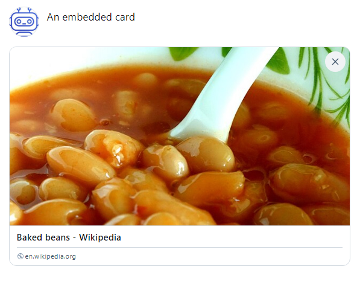

# <a name="posting">Posting</a>

## <a name="creatingAPost">Creating a post</a>

Let's start off by creating a simple post with the `CreatePost()` method.

```c#
var postResult = await agent.Post("Hello world!");

if (postResult.Succeeded)
{
    Console.WriteLine("Post created");
    Console.WriteLine($"  Post AT URI: {postResult.Result.StrongReference.Uri}");
    Console.WriteLine($"  Post CID:    {postResult.Result.StrongReference.Cid}");
}
```

The result from creating a post contains. amongst other things, a strong reference to the new record. This `StrongReference` consists of an
[AT URI](https://atproto.com/specs/at-uri-scheme) and a Content Identifier ([CID](https://github.com/multiformats/cid)). 

An AT URI is a way to reference individual records in a specific repository (every Bluesky user has their own repository).

A CID is a way to identify the contents of a record using a fingerprint hash. 

The AT URI, or a record's complete `StrongReference` are used as a parameters in methods which deal with existing Bluesky records, for example,
liking or deleting a post.

### Setting the language on a post

Setting the post's language helps custom feeds or other services filter and parse posts. You can set the posts language or languages using the language argument:

```c#
await agent.Post("G'day world!", language: "en-au");
```

Or if you have multiple languages

```C#
await agent.Post("สวัสดีชาวโลก!\nHello World!"", languages: new string[] {"th", "en-US"});
```

### Setting the creation date on a post

You can also set a specific create date and time on a post by using the `createdAt` parameter.

```c#
await agent.Post("Hello world from the past.", 
                 createdAt: new DateTimeOffset(new DateTime(1900, 1, 1)));
```

If you don't provide `createdAt` the current date and time will be used.

## <a name="understandingPostResults">Understanding the results from a post call</a>

The `Post()` method creates a record in your Bluesky repo and returns an`AtProtoHttpResult<CreateRecordResponse>`
This encapsulates the HTTP status code returned by the Bluesky API, the result of the operation,
if the operation was successful, any error messages the API returned, and information on the current rate limits applied to you,
which can be useful for making sure you don't flood the servers and get locked by a rate limiter.

To check if the call was successful you can check the `Succeeded` property of the `HttpResult`, which will be `true` if the operation succeeded.
If its false, the `StatusCode` property will contain the HTTP status code returned by the Bluesky API, and the `AtErrorDetail` property will contain any
error information the API returned.

```c#
var postResult =  await agent.Post("Hello world!");

if (postResult.Succeeded)
{
    // The post was created successfully.
    // postResult.Result contains the CreateRecordResponse returned by the API.

    Console.WriteLine($"  Post AT URI: {postResult.Result.StrongReference.Uri}");
}
else
{
    Console.WriteLine($"{postResult.StatusCode} occurred when creating the post.");
    Console.WriteLine($"Error details: {postResult.AtErrorDetail}");
}
```

## <a name="deletingAPost">Deleting a post</a>

"Hello world" isn't exactly the most engaging post, so now is a good time to look at how to delete posts.

To delete a post you can use a post's AT URI, or a post's strong reference, pass it to `DeletePost()` and now the post is gone.
For example, to delete the post you just made using the first code snippet above you would pass the an AT URI returned as part of the strong reference
you got from creating the post, or the strong reference itself.

```c#
var deleteResult = await agent.DeletePost(postResult.Result.StrongReference.Uri);
if (!deleteResult.Succeeded)
{
    Console.ForegroundColor = ConsoleColor.Red;
    Console.WriteLine($"{deleteResult.StatusCode} occurred when deleting the post.");
}
```

## <a name="replyingToAPost">Replying to a post</a>

To reply to a post, again, you need a post's `StrongReference`, which you pass into `ReplyTo()`.

```c#
// Create a test post we will reply to.
var createPostResponse = 
    await agent.Post("Another test post, this time to check replying.");

// Reply to the post we just created
var replyCreatePostResponse = 
    await agent.ReplyTo(createPostResponse.Result.StrongReference, "This is a reply.");

// Reply to the reply using the reply's StrongReference
var replyToReplyStrongReference = 
  await agent.ReplyTo(replyCreatePostResponse.StrongReference, "This is a reply to the reply.");
```

Replying to a post creates a new record, and it may not surprise you to see that the `ReplyTo()`
methods returns an `HttpResult<CreateRecordResponse>` just like creating a post does.

## <a name="likeRepostQuote">Liking, reposting and quote posting posts</a>

To like a post you need its `StrongReference`, which you then pass to `agent.Like()`.

```c#
var likeResult = await agent.Like(postStrongReference);
```

To unlike a post call delete like with the AT-URI of the post to unlike.

```c#
var undoResult = await agent.DeleteLike(postUri);
```

Reposting works in just the same way.

```c#
var repostResult = await agent.Repost(postStrongReference);
var undoRepostResult = await agent.UndoRepost(repostResult.Result);
```

Quoting a post requires both the post strong reference, and the text you the quote post to contain.
Deleting a post quoting another post is like deleting a regular post, you call `DeletePost`;

```c#
var quoteResult = await agent.Quote(postStrongReference, "This is a quote of a post.");
var deleteResult = await agent.DeleteQuote(quoteResult.Result!);
```

## <a name="postRelationships">Getting your relationships with a post</a>

You can see if you have liked or reposted by examining the view of the post you get from a feed. If you're not dealing with feeds you can get a `PostView`
by calling `GetPostView()` with a `StrongReference` to the post. A `PostView` contains an optional `Viewer` property, which is present should you have
reposted, liked, pinned or muted the post, or if the post author has disabled replies to, or embedding of the post.

If you liked a post then its `PostView.Viewer.Like` property will contain an AT Uri to your own like record, which you can use to unlike.

If you reposted the post then `PostView.Viewer.Repost` will contain the AT Uri of your repost record, which you can use to delete the repost record. 

## <a name="richPosts">Making rich posts</a>

[Rich Posts](https://docs.bsky.app/docs/advanced-guides/post-richtext), in Bluesky parlance, are posts which have facets.
Facets are post features, three of which are currently supported, links, mentions, and hashtags.

### <a name="autoDetection">Facet auto-detection</a>

The majority of the `Post()` APIs will try to detect links, mentions and hashtags automatically, although you can disable this by setting the
`extractFacets` parameter to `false`. For example:

```c#
var postResult =  await agent.Post("Hello #beans");
```

This will result in a hashtag of beans being added to the post. Detection works for hashtags, @ mentions and for uris which begin with either
https:// or http://.

The only `Post()` method that doesn't auto-detect and extract facets is `Post(PostBuilder, CancellationToken)` as the `PostBuilder` class allows you to
specifically add facets as you build your post, see [Building facets with a PostBuilder](posting.md#postBuilder).

> [!TIP]
> You can write your own facet extractor if the default one doesn't work exactly as you want, by implementing `IFacetExtractor`.
>
> `IFacetExtractor` has a single method, `ExtractFacets(string, CancellationToken)` that you need to implement.
> This is an `async` method, as creating a mention facet requires you to resolve the detected handle to a DID.
>
> To replace the default extractor set the `FacetExtractor` property on the instance of `BlueskyAgentOptions` that you pass into the `BlueskyAgent` constructor.

### <a name="postBuilder">Building facets with a PostBuilder</a>

While you can rely on auto-detection, or create facets manually, and attach them to a `PostRecord` and call down into the lower levels of the library to create a post record another option is available, a `PostBuilder`.

You can use the `PostBuilder` class to create facets, each facet has its own class which you can add to the `PostBuilder`.
Each of these classes a parameter specific to the facet type, DIDs for mentions, strings for hashtags and URIs for links. They also have a text parameter, the text in a post you want the facet to apply to.

`PostBuilder` works much like a `StringBuilder` does, you create an instance of it, and build your post bit by bit, adding/appending to the `PostBuilder` until you're ready to create a post from it, which you do by calling `agent.Post()` with the `PostBuilder`.

#### Mentions

To mention someone in a post you must know their DID, which you can get by resolving their handle.
Then create a `Mention` instance and add it to your `PostBuilder`, then finally call `agent.Post()` with your PostBuilder.

```c#
string userToTagHandle = "userHandle.test";
var userToTagDid = await agent.ResolveHandle(userToTagHandle);
if (did is null)
{
  // handle did not resolve to a did, react accordindly.
}

var builder = new PostBuilder("Hello ") + new Mention(userToTagDid, $"@{userToTagHandle}");
var mentionPostResult = await agent.Post(builder);
```
One thing of note: the text doesn't have to match the "@handle" format, that's just convention.

#### Links to external web sites

For links to web sites you create a new instance of a `Link`:

```c#
Uri uriToLinkTo = new("https://bsky.app/");

var builder = new PostBuilder("Click me ") + new Link(uriToLinkTo, uriToLinkTo.ToString());
var linkPostResult = await agent.Post(builder);
```

Again you can choose whatever text you want, so you could generate links in posts where the linked part of the post is just textual rather than a URI:

```c#
Uri uriToLinkTo = new("https://bsky.app/");

var builder = new PostBuilder("Click me to ") + new Link(uriToLinkTo, "visit Bluesky");
var linkPostResult = await agent.Post(builder);
```

#### HashTags

To insert a hashtag you create a new `Hashtag` instance:

```c#
PostBuilder hashtagBuilder = new PostBuilder("This will have a hashtag. ") + new Hashtag("test");
var hashtagPostResult = await agent.Post(hashtagBuilder);
```

> [!TIP]
> The `HashTag` does not begin with the # character. If you include a hash character you end up with a double hashed tag.

Of course, you can chain everything together:

> [!TIP]
> If you chain multiple HashTags together with `Append` they will be posted without a separator between them. You might want to append them like this.
> 
> `postBuilder.Append(" ");`<br/>`postBuilder.Append(new HashTag(hashtag));`

```c#
string userToTagHandle = "userHandle.test";
var userToTagDid = await agent.ResolveHandle(userToTagHandle);

var postBuilder = new("Hey ");

postBuilder.Append(new Mention(userToTagDid, $"@{userToTagHandle}"));

postBuilder.Append(" why not try some delicious ");

var shroudedLink = new Link("https://www.heinz.com/en-GB/products/05000157152886-baked-beanz", "beans");
postBuilder.Append(shroudedLink);
postBuilder.Append("? ");

postBuilder.Append("\nRead more: ");
var link = new Link("https://en.wikipedia.org/wiki/Heinz_Baked_Beans");
postBuilder.Append(' ');
postBuilder.Append(link);
postBuilder.Append('.');

var hashTag = new HashTag("beans");
postBuilder.Append(hashTag);

var facetedCreatePostResponse =
    await agent.Post(postBuilder, cancellationToken: cancellationToken);
```

> [!CAUTION]
> Do not concatenate facets with other facets or strings, for example:
> 
> `postBuilder.Append(" " + new Link("https://en.wikipedia.org/wiki/Heinz_Baked_Beans"));`
> 
> C# will call `ToString()` on the `Link`` as it is being appended to a string and your post will look something like this:
>
> `Link { Text = Read More, Uri = https://en.wikipedia.org/wiki/Heinz_Baked_Bean }`
> 
> Separate your `PostBuilder` append calls into individual statements:
>
> `postBuilder.Append(" ")`<br />`postBuilder.Append(new Link("https://en.wikipedia.org/wiki/Heinz_Baked_Bean", "Read More"));`

## <a name="images">Posting with images</a>

Creating a post with one or more images is a two step process, upload the image as a blob, then create a post with a reference to the newly created blob.

To upload an image you need the image as a byte array, which you can get by copying a stream to a memory stream, for example:

```c#
byte[] imageAsBytes;
using (FileStream fs = File.OpenRead(pathToImage))
using (MemoryStream ms = new())
{
    fs.CopyTo(ms);
    imageAsBytes = ms.ToArray();
}
```

Once you have your byte array upload it using `UploadImage`:

```c#
var imageUploadResult = await agent.UploadImage(
    imageAsBytes,
    "image/jpg",
    "The Bluesky Logo",
    new AspectRatio(1000, 1000),
    cancellationToken: cancellationToken);
```

There is no validation done on the MIME type by Bluesky when uploading a blob, it is up to you to choose the
[correct one](https://developer.mozilla.org/en-US/docs/Web/HTTP/Basics_of_HTTP/MIME_types/Common_types).

If you upload a blob but don't use it in a post it will get deleted within an unspecified amount of time.

If the call to `UploadImage` didn't error you can pass its result to `agent.Post()`.

```c#
if (imageUploadResult.Succeeded)
{
    var createPostResult = await agent.Post(
      "Hello world with an image.",
      imageUploadResult.Result,
      cancellationToken: cancellationToken);
}
```

If you have multiple images you can pass an `ICollection<EmbeddedImage>` into `agent.Post()`

You can, of course, add images to a `PostBuilder`:

```c#
PostBuilder postBuilder = new("A reply with an image.");

var imageUploadResult = await agent.UploadImage(
    imageAsBytes,
    "image/jpg",
    "The Bluesky Logo",
    new AspectRatio(1000, 1000),
    cancellationToken: cancellationToken);
if (imageUploadResult.Succeeded)
{
    postBuilder += 
        new EmbeddedImage(replyImageBlobLink.Result!, "Image alttext", new AspectRatio(1000, 1000));
}
```

## <a name="selfLabels">Self-labelling your posts</a>

Bluesky allows you to [self label](https://docs.bsky.app/docs/advanced-guides/moderation#global-label-values) a post, classifying the media the post contains.
You can label a post to indicate it contains one, or more, of the following classifications:

* Porn, which puts a warning on images and can only be clicked through if the user is 18+ and has enabled adult content,
* Sexual, which behaves like porn but is meant to handle less intense sexual content,
* Graphic-Media, which behaves like porn but is for violence / gore and
* Nudity which puts a warning on images but isn’t 18+ and defaults to ignore.

You can classify a post by passing in an instance of `PostSelfLabels` to any of the `agent.Post()` methods, with the properties set to indicate your content classification,
or into a `PostBuilder` via the constructor, or via the `SetSelfLabels` method.

```c#
var labels = new PostSelfLabels
{
    Porn = true,
    GraphicMedia = true,
    Nudity = true,
    SexualContent = true
};

var postResult = await agent.Post("Naughty bean content", labels : labels, cancellationToken: cancellationToken);

var postBuilder = new PostBuilder("Naughty bean content");
postBuilder.SetSelfLabels(labels);
var builderPostResult = await agent.Post(postBuilder, cancellationToken: cancellationToken);
```

## <a name="openGraphCards">Embedding an external link (Open Graph cards)</a>

[Open Graph](https://ogp.me/) is a standard that allows web pages to become a rich object in a social graph. Open Graph metadata allows you to embed a rich link card in a Bluesky post, which will look something like this:



To embed an external link with a card create an instance of `EmbeddedExternal` then attach it to a `PostBuilder` with the `Embed()` method.

```c#
var embeddedExternal = new(pageUri, title, description, thumbnailBlob);
var postBuilder = new PostBuilder("Embedded record test");
postBuilder.EmbedRecord(embeddedExternal);

var postResult = await agent.Post(postBuilder, cancellationToken: cancellationToken);
```

If you don't want to use a `PostBuilder` you can use the appropriate `Post()` method

```c#
var postResult = agent.Post(externalCard: embeddedExternal, cancellationToken: cancellationToken);
```

You can use libraries like [OpenGraph.net](https://github.com/ghorsey/OpenGraph-Net/) or [X.Web.MetaExtractor](https://www.nuget.org/packages/X.Web.MetaExtractor) to retrieve Open Graph properties from which you can construct a card.
For example, using OpenGraph.Net

```
Uri pageUri = new ("https://en.wikipedia.org/wiki/Baked_beans");
OpenGraph graph = await OpenGraph.ParseUrlAsync(pageUri, cancellationToken: cancellationToken);

string? title = graph.Title;
string? description = graph.Description;

// Check to see if there's a different URI specified in the graph metadata.
if (graph.Url is not null)
{
    pageUri = graph.Url;
}
```
The [Embedded Card sample](https://github.com/blowdart/idunno.atproto/tree/main/samples/Samples.EmbeddedCard) shows how to use
OpenGraph.Net to extract the metadata, and to retrieve a preview image and use it, if the metadata has an image property.

Posts with an embedded card don't need any post text.
