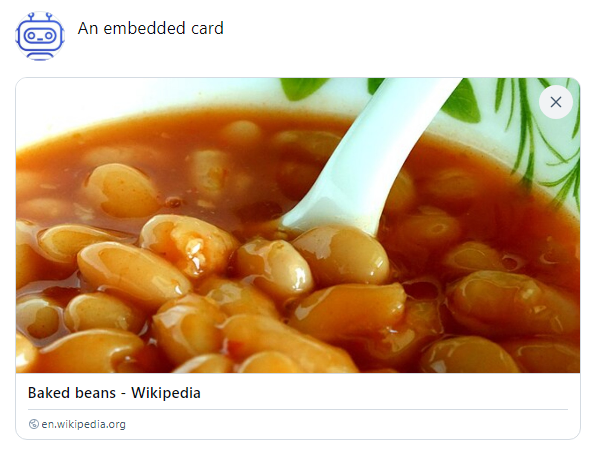
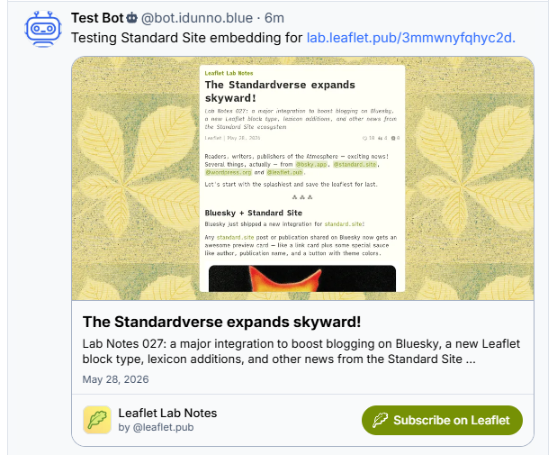

# Embedded cards in posts

Bluesky supports embedding content from external websites in posts, through cards. A card can be created
from [Open Graph](https://ogp.me/) metadata, or [standard.site](https://standard.site) known metadata embedded in the page linked to.

To create a card you create an instance of a card generator, call the `Generate` method, and
then attach the results to a post.

For example, to create a card from Open Graph metadata:

[!code-csharp]

This will create a Bluesky post that has a card attached to it, rendered in a client that supports cards.

Card generators require the agent to be authenticated to allow the uploading of any thumbnail image.

You may notice that the URI for the code does not need to appear in the text of the post, as the card is attached to the post separately.
This can be useful for creating more engaging posts that don't rely on links in the text.

site.standard metadata takes the card functionality a step further, the Bluesky client embeds interactive buttons
to subscribe to the publication, or read the document.

[!code-csharp]

Posts can only have one card attached to them, so if you have multiple links in a post, you will need to choose which one to create a card for.

> [!TIP]
> The standard.site metadata format is a superset of Open Graph, so you can use the StandardSiteEmbeddedCardGenerator to create cards from Open Graph metadata.
> Practically, this means you always use the StandardSiteEmbeddedCardGenerator without worrying about losing support for Open Graph metadata.
>
 > If the page can't be fetched (or if the page declares an invalid canonical URL via `og:url`), card generators will return `null`.
