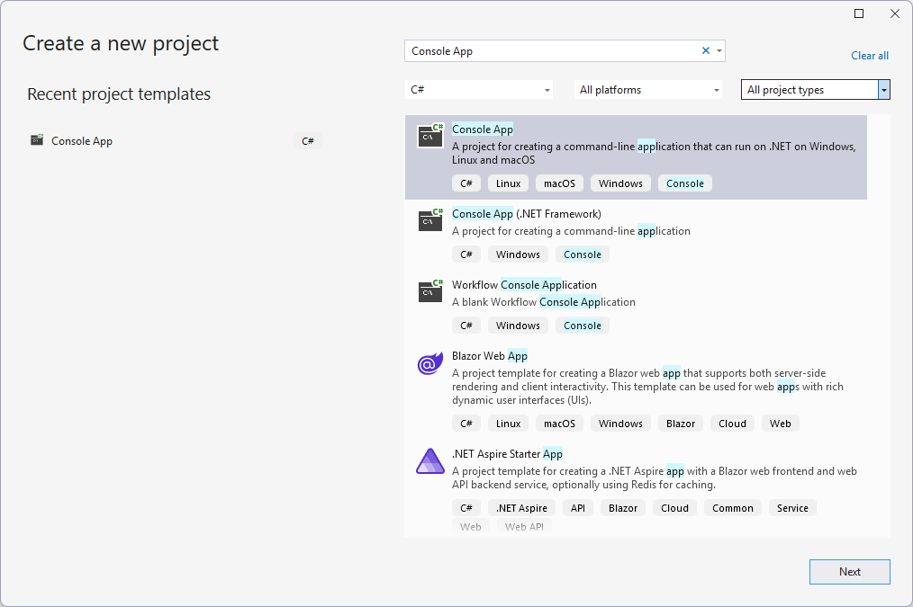

# Get started

Let's make your first post to Bluesky via the API in under 5 minutes.

## Create a .NET project with the idunno.Bluesky nuget package

# [Command Line](#tab/commandlineProjectCreate)

1. At the command line run the following commands
   ```PowerShell
   dotnet new console -n HelloBluesky
   cd HelloBluesky
   dotnet add package idunno.Bluesky --prerelease
   ```

# [Visual Studio](#tab/visualStudioProjectCreate)

1. Create a new .NET Command Line project by opening the File menu, and choosing **New ▶ Project**.
1. In the "**Create a new project**" dialog select C# as the language, choose **Console App** as the project type then click Next.
   
1. In the "**Configure your new project**" dialog name the project `HelloBluesky` and click Next.
1. In the "**Additional information**" dialog choose a Framework of .NET 8.0, uncheck the "Do not use top level statements" check box then click **Create**.
   
1. Under the **Project** menu Select **Manage nuget packages**, select the *Browse* tab, ensure that the Include prelease checkbox is checked. Search for `idunno.Bluesky`, and click **Install**.
1. Close the **Manage nuget packages** dialog.

# [Visual Studio Code](#tab/vsCodeProjectCreate)

First configure VS Code to [allow pre-release nuget packages](https://code.visualstudio.com/docs/csharp/package-management#_include-prerelease-package-versions).

1. Create a new .NET Command Line project by opening the Command Palette (**Ctrl + Shift + P**) and search for **.NET New Project**
1. In the Create a new .NET Project template search for and select **Console App**
1. Select the folder you want to save your poject in
1. Name your project `HelloBlusky`
1. Choose the solution format you prefer.
1. Press *Enter* to create the solution.
1. Select the HelloWorld.csproj file in Explorer window.
1. Opening the Command Palette (Ctrl + Shift + P) and search for **Nuget: Add**
1. Enter `idunno.Bluesky` in the package search dialog and choose the latest version.

---

### Create a session

# [Command Line](#tab/commandlineSessionCreate)

1. Open the `Program.cs` file in your editor of choice and change its contents to the following code, replacing
the `"handle"` and `"password"` parameters in the `agent.Login()` call with your Bluesky handle and password.
  [!code-csharp[](docs/code/createASession.cs?highlight=4)]
2. Save the changed file.

# [Visual Studio](#tab/visualStudioSessionCreate)

1. Open the `Program.cs` file from the Solution Explorer window and change its contents to the following code, replacing
the `"handle"` and `"password"` parameters for in the `agent.Login()` call with your Bluesky handle and password.
  [!code-csharp[](docs/code/createASession.cs?highlight=4)]
2. Save the changed file.

# [Visual Studio Code](#tab/vsCodeSessionCreate)

1. Open the `Program.cs` file from the Explorer window and change its contents to the following code, replacing
the `"handle"` and `"password"` parameters for the `agent.Login()` method with your Bluesky handle and password.
  [!code-csharp[](docs/code/createASession.cs?highlight=4)]
2. Save the changed file.

___

> [!TIP]
> You can create and use an [App password](https://bsky.app/settings/app-passwords) instead of your login password.
>
> App Passwords are safer as they allow sign in without granting full access to your Bluesky account.

### Create a post

# [Command Line](#tab/commandlinePostCreate)

1. Continue to change `Program.cs` by adding an additional line to create a post.
   [!code-csharp[](docs/code/helloWorld.cs?highlight=5)]
1. Save the changed file and exit your editor.
1. Compile and run your project with the following command
   ```PowerShell
   dotnet run
   ```

# [Visual Studio](#tab/visualStudioPostCreate)
1. Continue to change `Program.cs` by adding an additional line to create a post.
   [!code-csharp[](docs/code/helloWorld.cs?highlight=5)]
1. Save the changed file.
1. Run the project by pressing **F5** or choosing **Start Debugging** under the Debug menu.

# [Visual Studio Code](#tab/vsCodePostCreate)
1. Continue to change `Program.cs` by adding an additional line to create a post.
   [!code-csharp[](docs/code/helloWorld.cs?highlight=5)]
1. Save the changed file.
1. Run the project by pressing **F5** or choosing **Start Debugging** under the Run menu.

---

The program should run without any errors, and if you check your own profile (click the Profile link in the app, or on [bsky.app](https://bsky.app/))
you should see a post that says "Hello World from idunno.Bluesky".

Congratulations, you've just posted from code!

You can @ someone in the post text, add hashtags, or http/https links and they will all get turned into the right type of link. Try it and check in the app.

### Next Steps

* [Understand how to make API calls and check their results and handle errors](docs/requestsAndResponses.md)
* [Make richer posts](docs/posting.md)
* [Read your timeline](docs/timeline.md)

